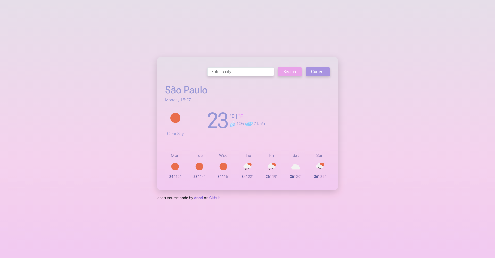
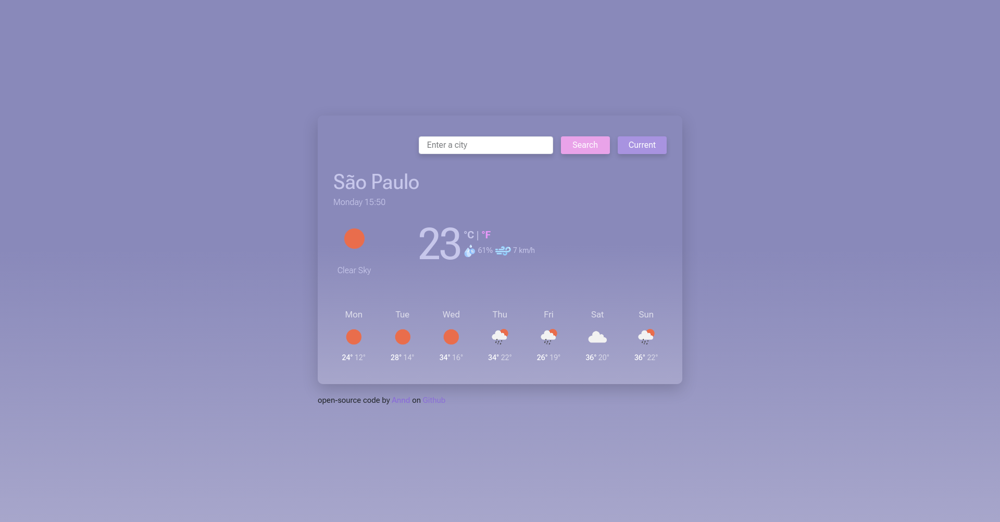

# Weather App

An **Weather App** project provided by SheCodes as a final project for their course **_SheCodes Plus_**

## About the Project:
The project was made to showcase my recent knowledge of how to use an API with **_Axios_** on Vanilla JavaScript.

## Features:
* Current and week forecast temperature using weather API
* Geolocation to get the current user's location
* Layout with Bootstrap and CSS 
* Fahrenheit conversion in the current temperature

## Resources:
* [Weather API](https://openweathermap.org/)
* [Icons and favicon](https://www.flaticon.com/)
* [Font](https://fonts.google.com/)
* [Gradient backgrounds](https://cssgradient.io/gradient-backgrounds/)

## Visit the Project:
Check the project out on [Github pages](https://anndcodes.github.io/weather-app/) or on [Netlify](https://weathernice.netlify.app/)

---
Made with 🩷 by Annd